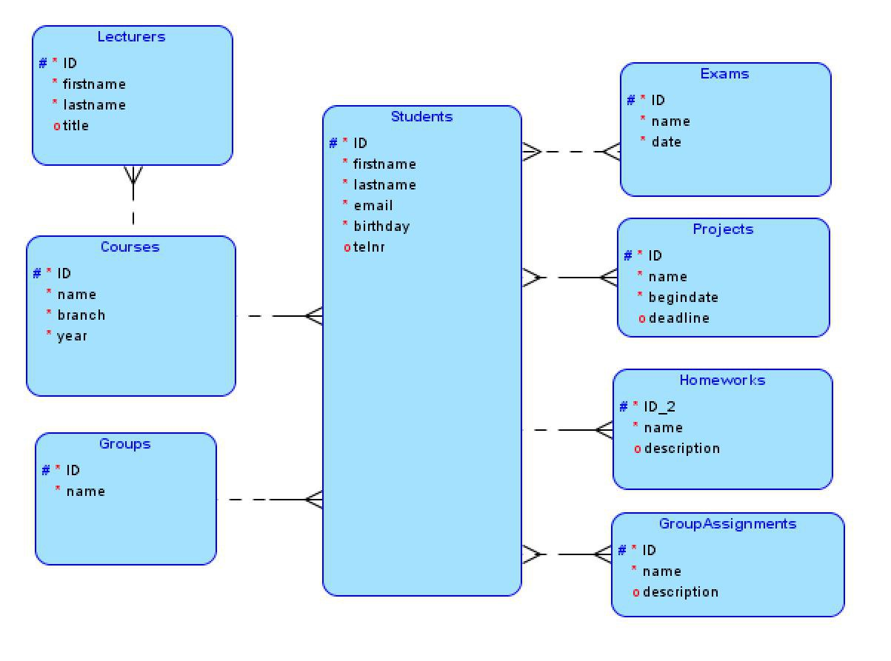
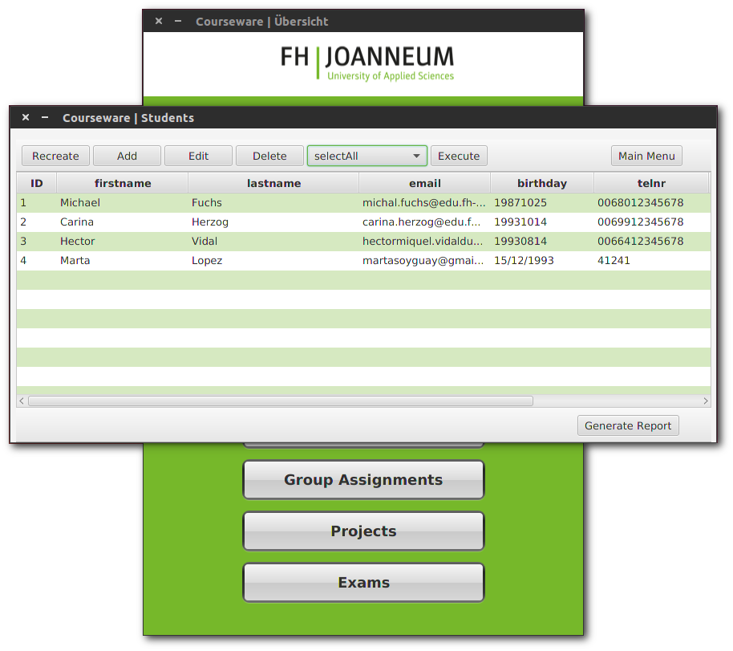
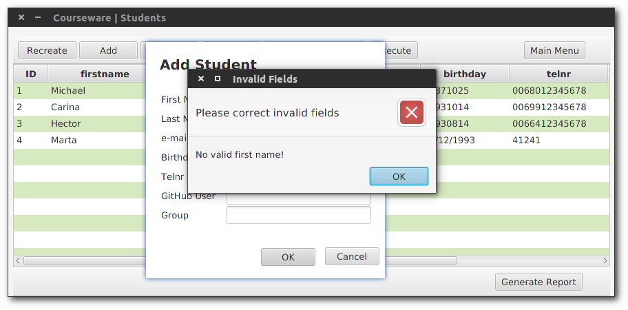

# fhj.swengb.courseware

We would like to provide a software that is able to provide the user with different kinds of information revolving around our SWENGB-Course. 
The user should be able to have insight into the students, the different assignments that were given and so on.

## Database
The database is a SQLite-Database that is based on the ER-Model shown below. 

The whole structure should enable us to provide information 
how many percent of people submit their homework in time or 
what the general participation rate is. The information can 
either be seen inside the GUI or via a markdown report.

## Screenshots

### Student Table

### Student Table

### Alert Window

## Built With

* Scala
* JavaFx
* Maven

## Credits

* _**[Michael Furch &raquo;](https://github.com/deKilla)**_ 
* _**[Carina Herzog &raquo;](https://github.com/carinaher)**_ 
* _**[Hector Vidal &raquo;](https://github.com/MikVidal)**_ 

## Contributing
1. Fork it!
2. Create your feature branch: `git checkout -b my-new-feature`
3. Commit your changes: `git commit -am 'Add some feature'`
4. Push to the branch: `git push origin my-new-feature`
5. Submit a pull request :D
